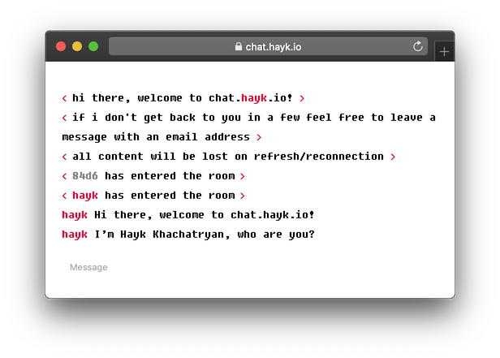

# chat.hayk.io
> web chat that syncs with a Slack workspace


Flask & SocketIO based webapp that connects with a Slack workspace and carries messages between the two
(hayk (owner) talks from Slack, user talks from webapp)



## Usage

```
$ gulp
```


## Release History

* 0.2.0
    * Some UX improvements:
        * Changed from < hayk > greeting at beginning to server greeting
        * Added a "leave a message" note
        * Changed from < hayk entered room > at beginning to whenever hayk sends first message
    * Added some crimson here and there
    * Now notifies via slack when someone joins instead of just messages
* 0.1.0
    * The first proper release

## Meta

Hayk Khachatryan – hi@hayk.io

Distributed under the MIT license. See ``LICENSE`` for more information.

[https://github.com/haykkh](https://github.com/haykkh/)

## Contributing

1. Fork it (<https://github.com/haykkh/chat.hayk.io/fork>)
2. Create your feature branch (`git checkout -b feature/fooBar`)
3. Commit your changes (`git commit -am 'Add some fooBar'`)
4. Push to the branch (`git push origin feature/fooBar`)
5. Create a new Pull Request

<!-- Markdown link & img dfn's -->
[npm-image]: https://img.shields.io/npm/v/datadog-metrics.svg?style=flat-square
[npm-url]: https://npmjs.org/package/datadog-metrics
[npm-downloads]: https://img.shields.io/npm/dm/datadog-metrics.svg?style=flat-square
[travis-image]: https://img.shields.io/travis/dbader/node-datadog-metrics/master.svg?style=flat-square
[travis-url]: https://travis-ci.org/dbader/node-datadog-metrics
[wiki]: https://github.com/haykkh/yourproject/wiki